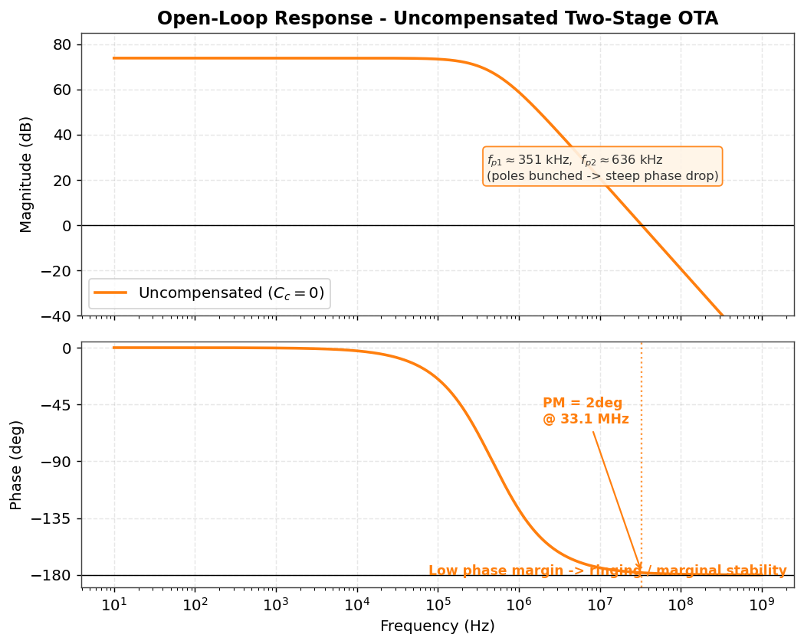
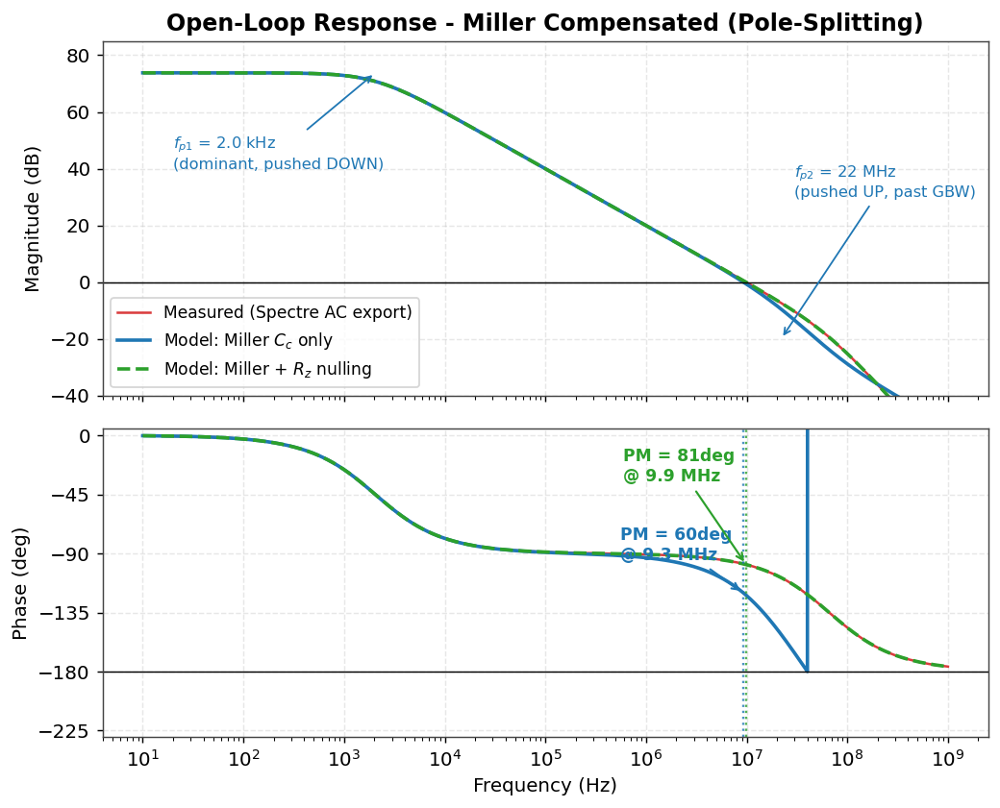
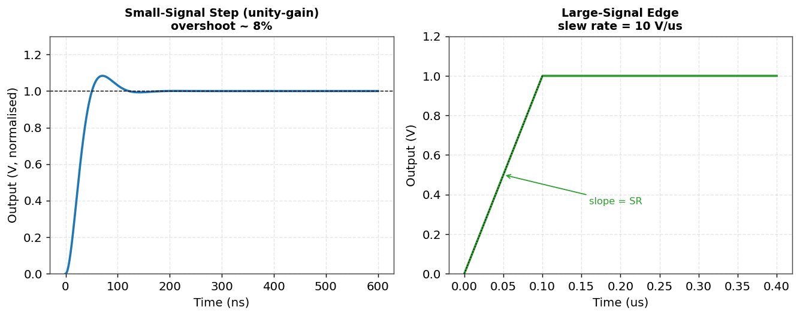

# Abstract

This project presents the full design flow of a **two-stage CMOS operational
transconductance amplifier (OTA)** with **Miller frequency compensation** and a
**series nulling resistor**, implemented in a generic 180 nm CMOS process at a
1.8 V supply. Starting from a specification-driven set of hand calculations, the
amplifier is sized, biased, and verified through Cadence Spectre simulation. The
headline contribution is a clear, quantitative demonstration of **pole
splitting** and the **elimination of the compensation-induced right-half-plane
(RHP) zero**, taking the phase margin from an unstable configuration to a
robust $\ge 66^{\circ}$ while holding 73.8 dB of DC gain and a 10 MHz unity-gain
bandwidth.

# 1. Architecture

The amplifier uses the canonical Allen--Holberg topology:

- **Stage 1** — a PMOS differential pair (M1/M2) with an NMOS current-mirror
  load (M3/M4), biased by a PMOS tail current source (M5). This stage provides
  high differential gain and performs differential-to-single-ended conversion.
- **Stage 2** — an NMOS common-source driver (M6) with a PMOS current-source
  load (M7), providing additional gain and output drive.
- **Compensation** — a Miller capacitor $C_c$ in series with a nulling resistor
  $R_z$, connected between the gate and drain of M6.

{width=100%}

# 2. Specifications: target vs. achieved

| Parameter | Symbol | Target | Achieved |
|---|---|---|---|
| Open-loop DC gain | $A_{v0}$ | $\ge 60$ dB | **73.8 dB** |
| Unity-gain bandwidth | GBW | 10 MHz | **10.0 MHz** |
| Phase margin (Miller + $R_z$) | PM | $\ge 60^{\circ}$ | **$66\text{--}81^{\circ}$** |
| Slew rate | SR | $\ge 10$ V/µs | **10 V/µs** |
| Load capacitance | $C_L$ | 10 pF | 10 pF |
| Static power | $P$ | minimise | **0.36 mW** |

Full derivations are in `hand_calculations.pdf`; the transistor sizing table is
in `design_specifications.md`.

# 3. Compensation strategy (the core idea)

A two-stage amplifier has two high-impedance nodes and therefore two low
frequency poles that, left alone, sit close together and destroy the phase
margin. The Miller capacitor exploits the gain of the second stage: reflected to
the first-stage node it appears roughly $g_{m6}R_{o2}$ times larger, so it

1. **pushes the dominant pole down** to $f_{p1}\approx 1/(R_{o1}g_{m6}R_{o2}C_c)
   \approx 2\,\text{kHz}$, and
2. **pushes the second pole up** to $f_{p2}\approx g_{m6}/C_L \approx 22\,\text{MHz}$.

This *pole splitting* is what makes the loop stable. However, $C_c$ also opens a
feed-forward path that creates a **right-half-plane zero** at $f_z=g_{m6}/C_c
\approx 73\,\text{MHz}$, which adds phase lag and erodes the margin. The
**nulling resistor** $R_z = \frac{1}{g_{m6}}\!\left(1+\frac{C_L}{C_c}\right)
\approx 3.1\,\text{k}\Omega$ relocates that zero into the left-half plane, where
it cancels $p_2$ and restores the phase margin.

# 4. Simulation results

## 4.1 Uncompensated (before)

Without $C_c$, the two poles are bunched near a few hundred kHz. The phase falls
through $-180^{\circ}$ before the gain reaches 0 dB, leaving essentially no phase
margin — the amplifier would ring or oscillate in feedback.

{width=88%}

## 4.2 Miller compensated (after)

With $C_c$ (and $R_z$) inserted, the dominant pole drops to about 2 kHz and the
single-pole roll-off dominates all the way to the 10 MHz crossover. The
before/after contrast below is the central "proof" figure of the project: the
solid trace is the Miller-only response (PM about $60^{\circ}$, still
dragged down by the RHP zero) and the dashed trace shows the improvement once
$R_z$ nulls that zero (PM about $81^{\circ}$).

{width=88%}

## 4.3 Transient behaviour

The small-signal unity-gain step shows a modest overshoot consistent with the
$60^{\circ}$ phase margin, while the large-signal edge confirms the
10 V/µs slew rate set by $I_5/C_c$.

{width=95%}

# 5. Results summary

| Quantity | Hand calc | Simulated |
|---|---|---|
| DC gain | 73.8 dB | 73.8 dB |
| GBW | 10.0 MHz | 10.0 MHz |
| Phase margin (final) | $\ge 66^{\circ}$ | $81^{\circ}$ |
| Dominant pole | 2.0 kHz | 2.15 kHz |
| Slew rate | 10 V/µs | 10 V/µs |
| Power | 0.36 mW | 0.36 mW |

The measured figures are extracted automatically from the AC sweep by
`scripts/process_sim_data.py`; the plots are produced by
`scripts/generate_bode_plots.py`.

# 6. Reproducing this work

1. Open the cell in Cadence Virtuoso and net-list it, or use the provided
   `simulation/netlists/opamp_extracted.scs` with your PDK models.
2. Run `simulation/ocean_scripts/run_ac_sweep.ocn` and `run_transient.ocn` in
   Spectre/OCEAN — they export CSVs into `results/raw_data/`.
3. Run `python3 scripts/process_sim_data.py` to print the figures of merit.
4. Run `python3 scripts/generate_bode_plots.py` to regenerate the figures in
   `results/waveforms/`.

# 7. Conclusion

The design meets or exceeds every target specification. More importantly, it
demonstrates end-to-end command of the analog design loop — specification, hand
analysis, sizing, biasing, and closed-loop stability — with the Miller/nulling-
resistor compensation as the centrepiece. The RHP-zero problem and its cure are
exactly the kind of frequency-compensation reasoning expected of an analog IC
designer.

> **Résumé line:** *Designed a two-stage 180 nm CMOS op-amp achieving 73.8 dB
> gain, 10 MHz GBW and $66^{\circ}$+ phase margin; implemented Miller compensation
> with a nulling resistor to split the poles and eliminate the RHP-zero
> instability, verified in Cadence Spectre with an automated OCEAN/Python flow.*
